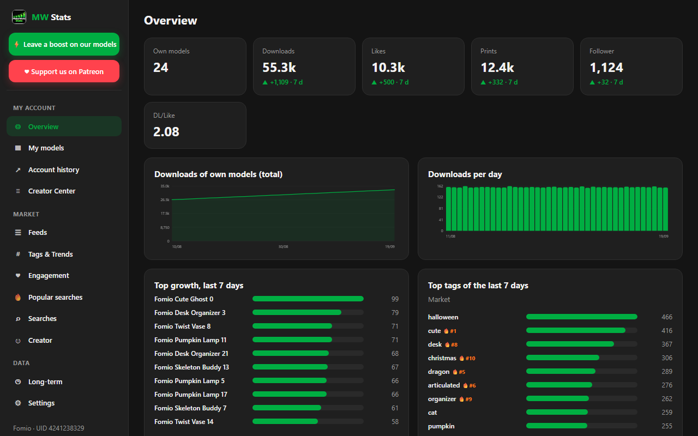
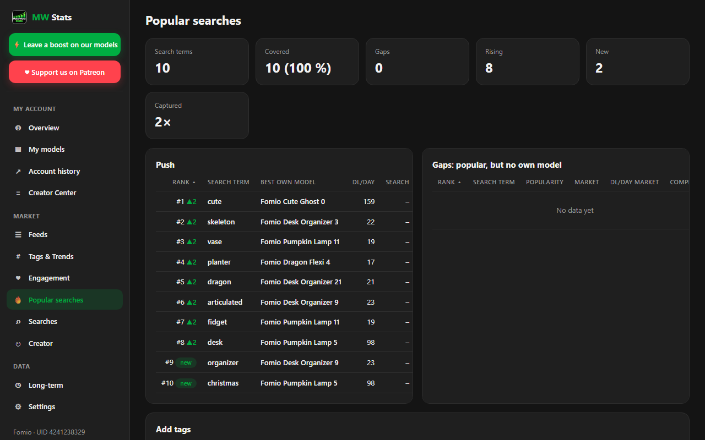
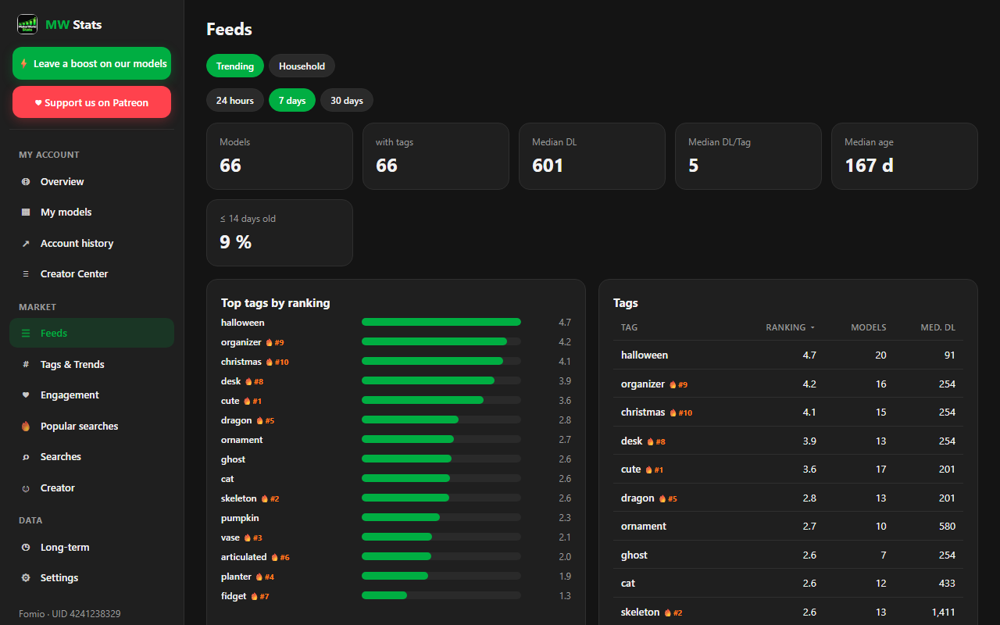
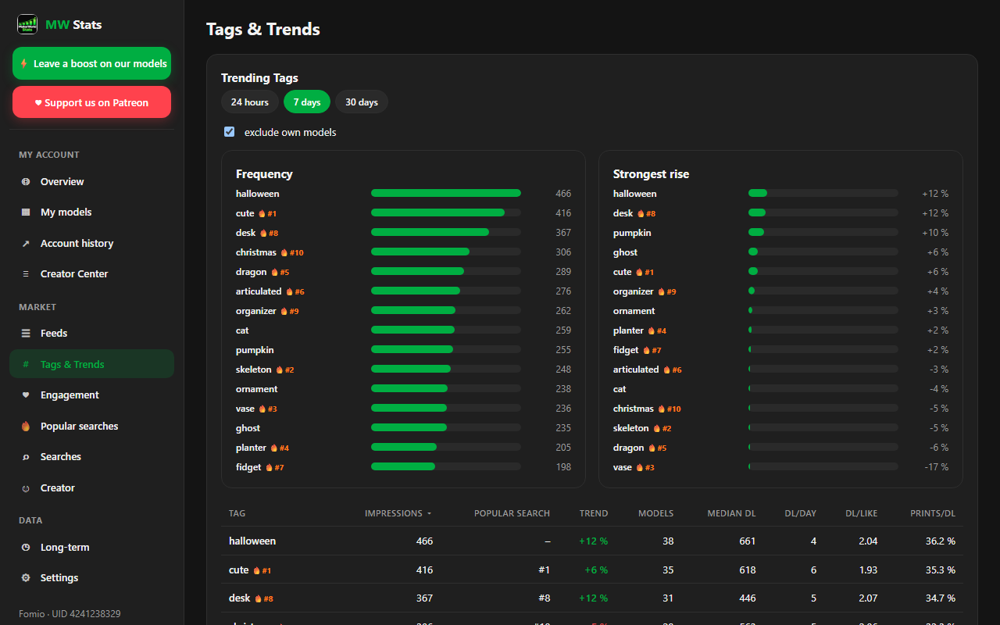
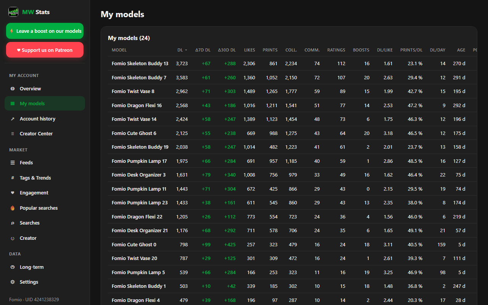
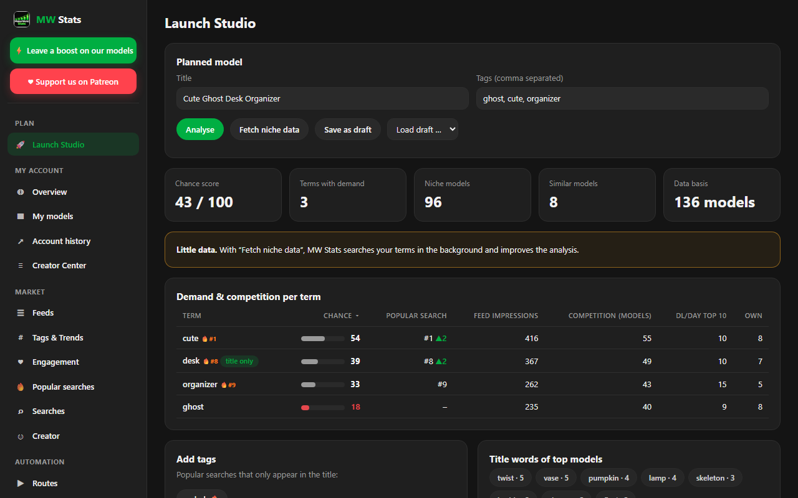
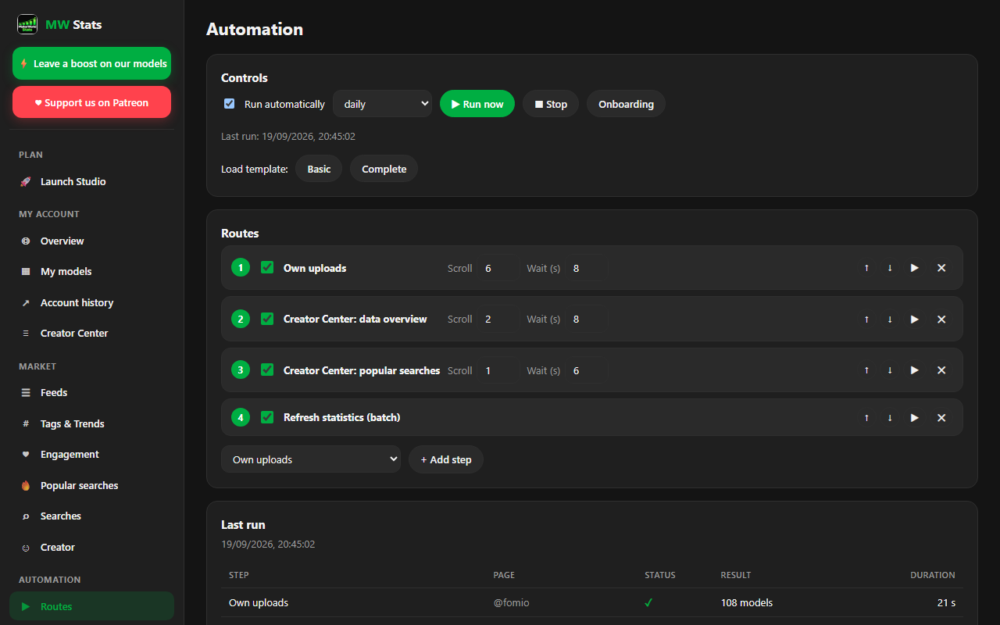

# MW Stats – Analytics for MakerWorld

Turns MakerWorld into an analytics dashboard for 3D-model creators. MW Stats reads the data MakerWorld already shows you while you browse and turns it into clear insights — right inside the page and in a full dashboard.

## What you get

- **Your models at a glance** — downloads, likes, prints, collections, ratings and boosts, with daily history and growth over 7 and 30 days.
- **Engagement ratios** — downloads per like, prints per download, comments and ratings per download, compared with the market.
- **Live search analysis** — a sidebar on every MakerWorld search shows what ranks on top, which tags dominate the top 20, which creators compete and where your own models appear.
- **Home feed analysis** — For You, Trending and every category tab are tracked separately, with a tag ranking weighted by position.
- **Popular searches** — compares MakerWorld's popular searches with your models: what to push, which search gaps you don't cover yet.
- **Model and creator pages** — ratios vs. market, tag benchmarks, similar models and creator comparisons.
- **Creator Center** — daily values from your data overview, merged across time ranges, with notable trends marked.
- **Launch Studio** — check a planned model before you upload it: demand and competition per search term, a chance score, suggested tags and title words, duplicate check.
- **Automation** — let MW Stats open your uploads, Creator Center, popular searches and the home feeds in a background tab and collect the data, manually or on a schedule.
- **Long-term database with backup** — compare tag rankings with last month or last year, export/import all data as a file.
- **Optional community data** — a single "Use & Share Public Data" switch lets you share public model metrics (downloads, likes, tags, …) with a small central service and see aggregated community trends in return. Off by default, and Creator Center / account data is never sent regardless of this setting.

| | | |
|---|---|---|
|  |  |  |
|  |  |  |

## Install

- **Chrome / Edge / Brave** (Chromium): [Chrome Web Store](https://chromewebstore.google.com/detail/mw-stats-%E2%80%93-analytics-for/gednlaeoicnlghmnbkineoancpilkhjj)
- **Firefox**: [addons.mozilla.org](https://addons.mozilla.org/de/firefox/addon/mw-stats-analytics-makerworld/)

## Privacy

By default, everything stays **locally in your browser** — no account, no login required. Since version 6, you can optionally turn on a single setting to share *public* model metrics (downloads, likes, tags, model name — never your MakerWorld login, session or Creator Center data) with a small central service, in exchange for seeing aggregated trends contributed by other installations. This is off unless you switch it on, and can be switched off again at any time.

Read the full [Privacy Policy](https://dandulox.github.io/mw-stats-privacy/) for details, including what is (and isn't) shared and why.

## Changelog

The in-app changelog (Dashboard → Changelog) is kept in sync with [`changelog.json`](changelog.json) in this repo, so you can see what changed even before updating.

## Disclaimer

MW Stats is an independent project by [Fomio](https://makerworld.com/@fomio) and is **not affiliated with, endorsed by or sponsored by Bambu Lab or MakerWorld**.
